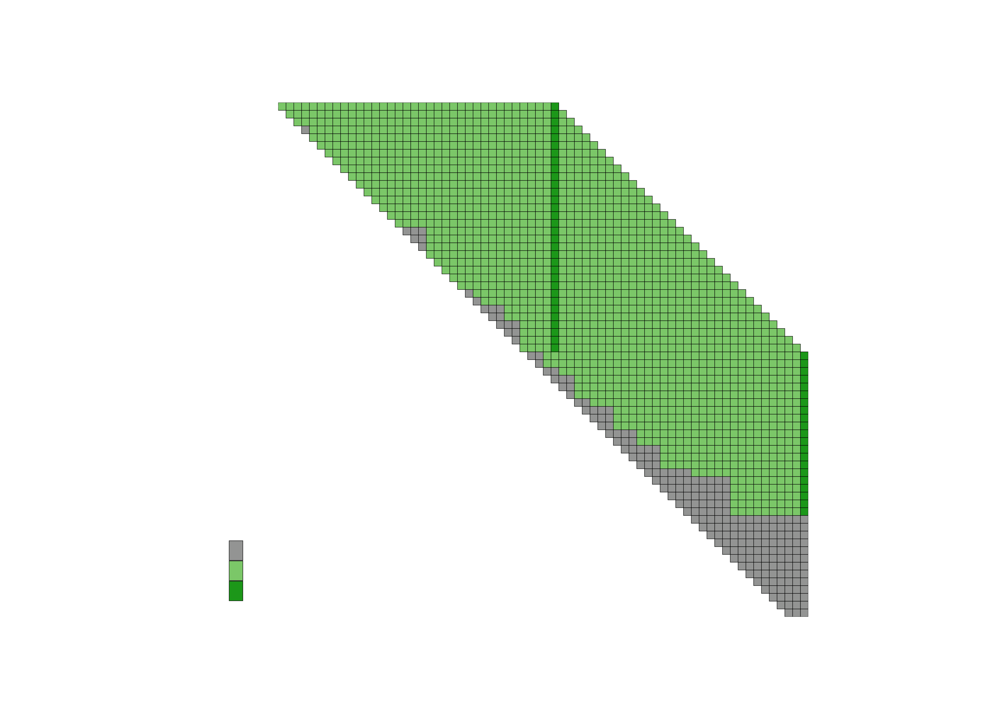

# dpukarchive

<!-- badges: start -->
<!-- badges: end -->

Lots of police data is made available for public use at
[data.police.uk](https://data.police.uk). The site offers an API - but,
on exploration, it seems like the API only gives access to data back as
far as 2021. The site also has an [‘archive’
page](https://data.police.uk/data/archive/) - the archive hosts data
from Dec 2010 onwards. <br>

However, the archive is difficult to use. It hosts a number of zipped
folders, available for download. Each zipped folder contains a number of
subfolders, which contain one month’s worth of data. For every month,
there should be one csv for each police force, for each data series
(crime, outcome, stop & search data), though some are missing. In sum,
there are lots of files inside folders inside folders, and to extract
the particular data files you want to use presently involves downloading
and manually searching through many files you don’t want. <br>

Plan: to try develop a package that makes interacting with the UK police
data archive easier.
<!-- I'm trying to take stock of the archive - figure out what data files are absent/present/present in multiple versions, how to interact with the archive in the most efficient way, etc.results='hide',fig.keep='all'-->

## Understanding what data is present in the archive

Have checked the contents of each zipped folder on the page, and
recorded that information in a table (code that produces the table is in
file
[archive_contents.R](https://github.com/katehayes/dpukarchive/blob/main/data-raw/archive_contents.R)
and the table itself is in the data folder). This info will feed into
package functions.

    ## # A tibble: 6 × 4
    ##   file_name                                      folder  should_contain contains
    ##   <chr>                                          <chr>   <lgl>          <lgl>   
    ## 1 2024-08/2024-08-avon-and-somerset-outcomes.csv zip202… TRUE           TRUE    
    ## 2 2024-08/2024-08-avon-and-somerset-outcomes.csv zip202… FALSE          FALSE   
    ## 3 2024-08/2024-08-avon-and-somerset-outcomes.csv zip202… FALSE          FALSE   
    ## 4 2024-08/2024-08-avon-and-somerset-outcomes.csv zip202… FALSE          FALSE   
    ## 5 2024-08/2024-08-avon-and-somerset-outcomes.csv zip202… FALSE          FALSE   
    ## 6 2024-08/2024-08-avon-and-somerset-outcomes.csv zip202… FALSE          FALSE

<!-- -->

For more details use function fs_report - specify police force, data
series, and time span, and the function returns a plot summarising the
presence/absence of the relevant files across the relevant folders.
Here’s an example of the plot for Wiltshire’s stop and search data for
the months of Jan 2019 to June 2024.

    ## 
    ## ── R CMD build ─────────────────────────────────────────────────────────────────
    ##      checking for file ‘/private/var/folders/lg/0bwf5znx08zgdprvsksvswxm0000gn/T/RtmpFg5Ezl/remotes72213644307d/katehayes-dpukarchive-8f1ac5c/DESCRIPTION’ ...  ✔  checking for file ‘/private/var/folders/lg/0bwf5znx08zgdprvsksvswxm0000gn/T/RtmpFg5Ezl/remotes72213644307d/katehayes-dpukarchive-8f1ac5c/DESCRIPTION’
    ##   ─  preparing ‘dpukarchive’:
    ##      checking DESCRIPTION meta-information ...  ✔  checking DESCRIPTION meta-information
    ##   ─  checking for LF line-endings in source and make files and shell scripts
    ##   ─  checking for empty or unneeded directories
    ##   ─  building ‘dpukarchive_0.0.0.9000.tar.gz’
    ##      
    ## 

<!-- -->

## Extracting data from the police data archive

Function arc_extract – should be able to specify police force, data
series, and time span, and have a dataframe returned efficiently.

``` r
## library(dpukarchive)
## basic example code
```

## Installation

You can install the development version of dpukarchive from
[GitHub](https://github.com/) with:

``` r
# install.packages("devtools")
# devtools::install_github("katehayes/dpukarchive")
```
